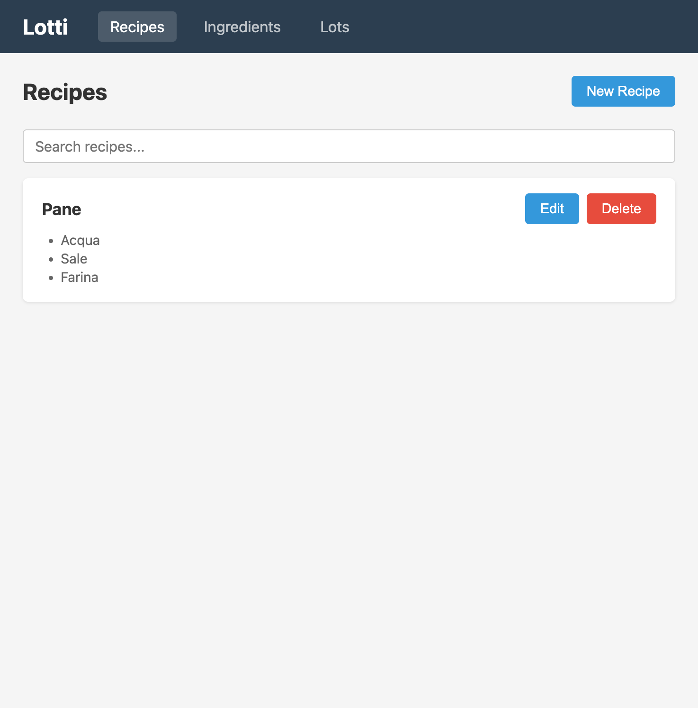
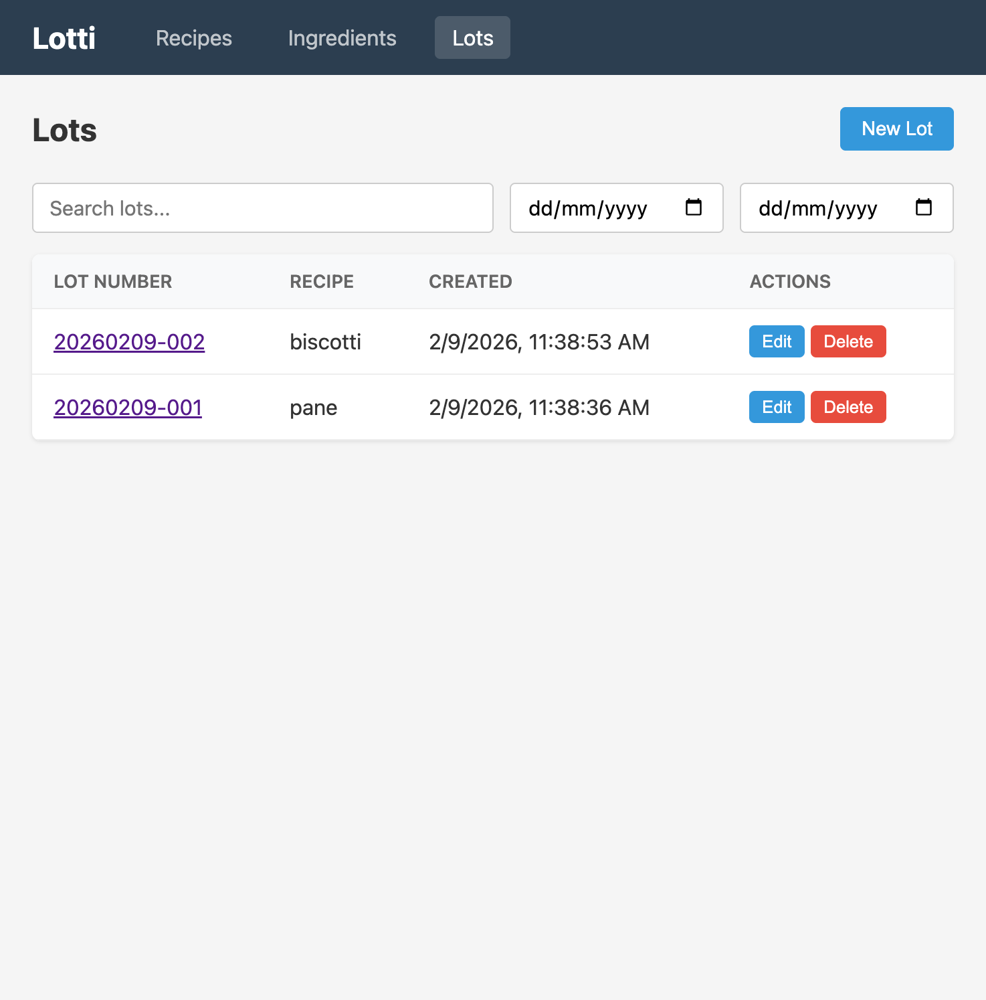
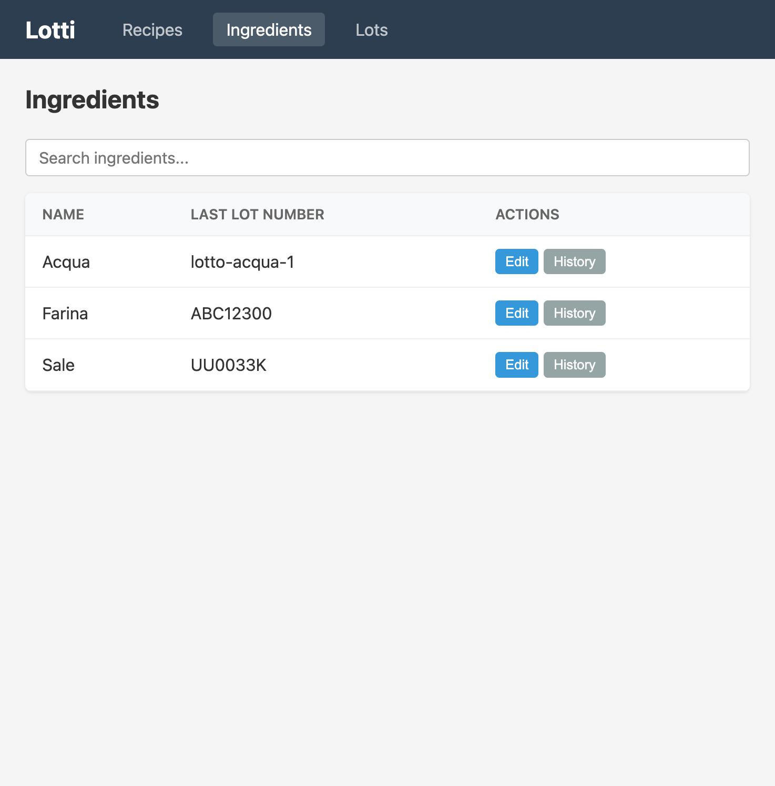
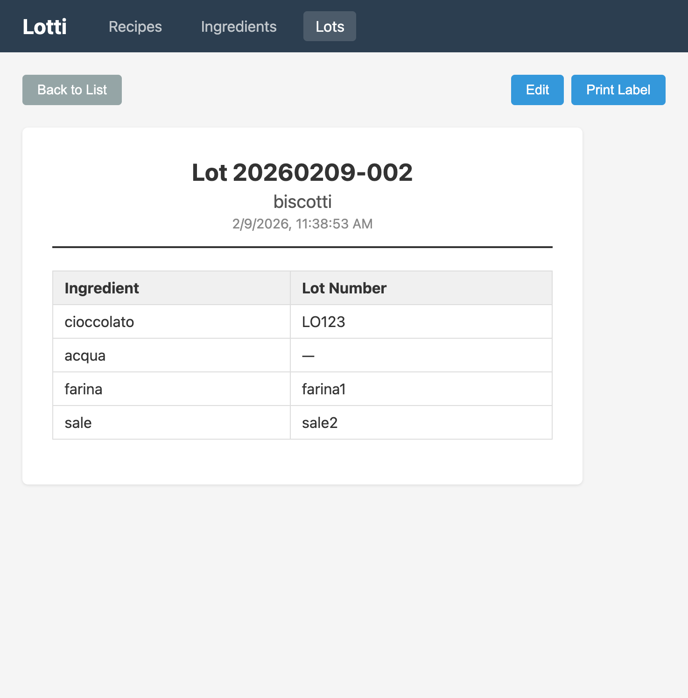

# LotTrack

Food production lot tracking app. Create recipes with ingredients, generate lots with unique lot numbers, and track ingredient lot numbers across productions.

## Screenshots

| Recipes | Lots |
|---------|------|
|  |  |

| Ingredients & Lot History | Lot Label |
|---------------------------|-----------|
|  |  |

## Stack

- **Frontend:** React, React Router, Vite, Nginx
- **Backend:** Express, TypeScript, pg (raw SQL)
- **Database:** PostgreSQL 16

## Running

Requires Docker (or OrbStack).

```bash
docker compose up --build
```

- Frontend: http://localhost:8080
- Backend API: http://localhost:3001

## Project Structure

```
backend/
  src/
    controllers/    # Request handlers
    services/       # Business logic & DB queries
    routes/         # Express route definitions
    db/migrations/  # SQL migrations (run at startup)
frontend/
  src/
    pages/          # Route-level page components
    components/     # Reusable UI components
    services/api.ts # API client
```

## Database Backup & Restore

**Backup:**

```bash
It's done automatically from lottracker-db-backup container
```

**Restore:**

```bash
docker exec -i <container_name> psql -U <db_user> -d <db_name> -c "DROP SCHEMA public CASCADE; CREATE SCHEMA public;"
cat <file>.dmp | docker exec -i <container_name> pg_restore -U <db_user> -d <db_name> --no-owner --verbose
```

## Features

- Recipe management (CRUD) with ingredient lists
- Lot creation with auto-generated lot numbers (YYYYMMDD-NNN)
- Per-ingredient lot number tracking with full history
- Search and date filtering on all list pages
- Printable lot labels
